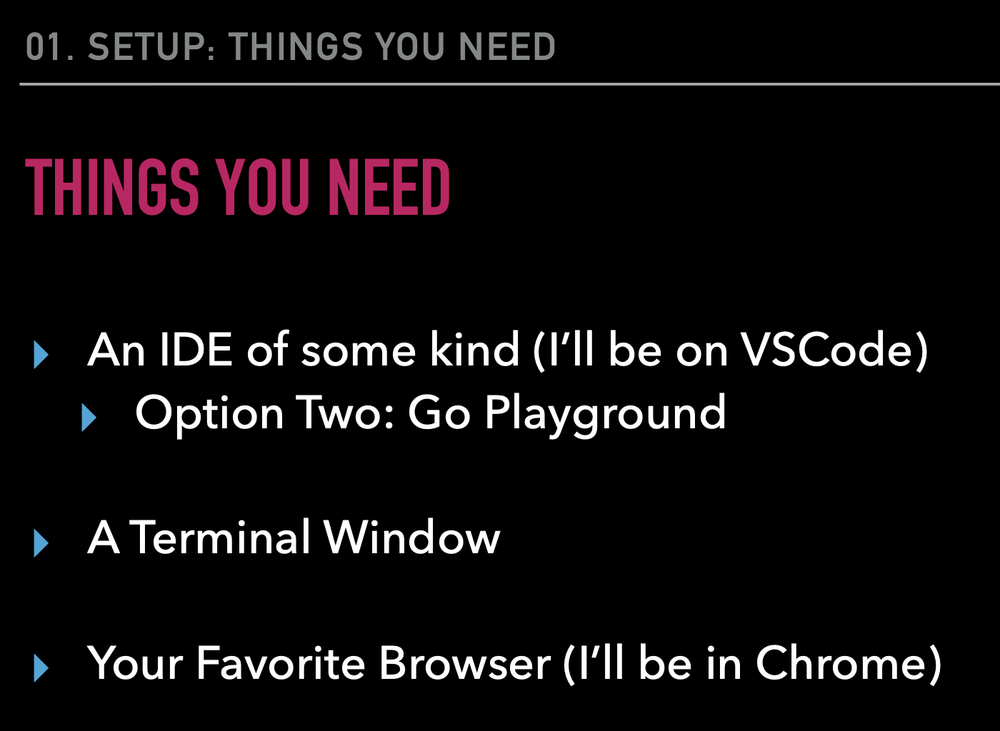
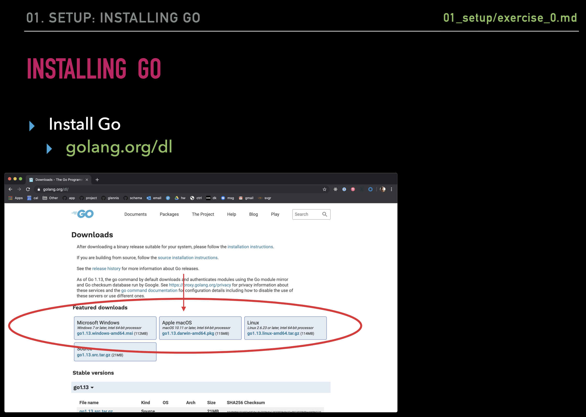
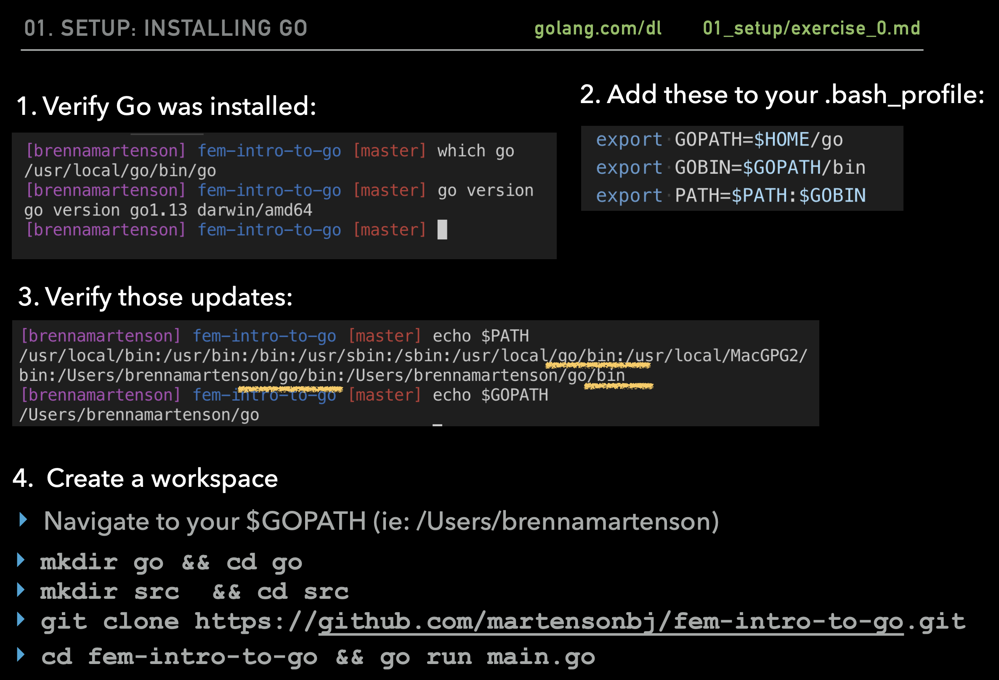

# Summary of GO for JS Dev
Summary of GO for Javascript Developer by Brenna Martenson. The objectives of this course is to learn the syntax of Go, what data structures are available to you, and how to handle errors responsibly. After getting an idea of what you have to work with, you’ll create a web server with routing, build an application to hit an external API, and receive a brief introduction on how the Go language manages concurrency with goroutines!

# Introduction
Go is a statically typed, compiled programming language designed at Google by Robert Griesemer, Rob Pike, and Ken Thompson. Go is syntactically similar to C, but with memory safety, garbage collection, structural typing, and CSP-style concurrency.

GO advantages :
- Fast complie times
- Ease of development (lots in common and reduces compleity of C language)
- Fast build time

### Installing GO

### GO vs JavaScript Comparison
| Type | GO | JS |
| ------------- | ------------- | ------------- |
| Typing | Strongly typed (String, Float, Int, Byte, Struct) | Dynamically typed (Variables can change ) |
| Structures | Structs, Pointers, Methods, Interfaces | ES6 Classes |
| Error Handling | Explicit | Built in |
| Multi Tasking | Multi-Threaded (Concurrency, Goroutines, Sync) | Single-Threaded (Callbacks, async await, sagas, sadness) |
| Opiniated-ness | Strong Opinions (Convention, built in tooling and linters) | Fluid Opinions (Subjective to the mood that day) |
